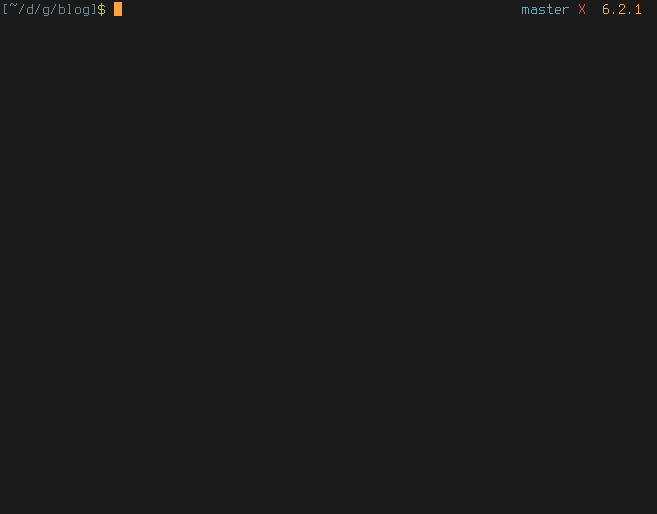

[](https://opensource.org/licenses/MIT) [](https://travis-ci.org/greg-js/wdn) [](https://coveralls.io/github/greg-js/wdn?branch=master)
# wdn - **w**arp **d**irectories **n**odeJS-style

`wdn` is a Node.js reimplementation of the [wd](https://github.com/mfaerevaag/wd) for `zsh`. It allows you to create warp points out of directories and then quickly warp (`cd`) to them using a very simple API. This should work in `bash` as well as in `zsh`and *might* work in other shells too, but I haven't tested it yet.

I found out after I started this that there is already a [Ruby package](https://github.com/kigster/warp-dir) out there written by kigster which accomplishes the same goal of a `wd` that works in all shells. Check it out as well before you decide to use this, but check out the differences section below because this package has some extra features too!



Oh, and if you believe strongly that it's crazy or stupid to use Node to navigate the file system, then that's fine, I respect your opinion and implore you not to use this. However, if you want a fun and convenient way to jump around the file system using the command-line, and you don't use `zsh` or `ruby`, then `wdn` is your friend :-)

**Note**: if you update from v2.x to v3.x, you *will* lose your saved warp points due to a backwards-incompatible change in how the warp points are stored)

## requirements

- Node v0.10 or above.
- npm v2.15 or above.

Install it using your package manager or [nvm](https://github.com/creationix/nvm).

This won't work on Windows, unless *maybe* if you run native bash.

If you want to use the `ssh` feature, you also need an [ssh config file](http://www.cyberciti.biz/faq/create-ssh-config-file-on-linux-unix/) in `~/.ssh/config` and/or `/etc/ssh/ssh_config`.

## installation

```
npm install -g wdn
```

(read [this](https://github.com/sindresorhus/guides/blob/master/npm-global-without-sudo.md) or install [nvm](https://github.com/creationix/nvm) if you find you need `sudo` to install global packages and dislike it)

Then put this in your `.bashrc`/`.zshrc`:

```
wdn() {
  source $(npm root -g)/wdn/bin/wdn.sh
}
```

Now open a new shell, reboot or `source` your file and you should be ready to go.

## differences between this package and others like it

`wdn` is slower and has a slightly different API compared to the original `wd` and `warp-dir`. It also doesn't have an `ls` command like they do.

On the flip side, `wdn` can execute arbitrary commands in any point with `wdn exec`/`wdn e`, so `wd mypoint ls` yields the same as `wdn exec mypoint ls`, and with `wdn`, you can add any option you like or execute different commands.

Also, `wdn` supports warp points for your remote hosts as well. It reads your `~/.ssh/config` and lets you `add`, `list`, `show`, `remove` and `clear` for every host you have set up. Of course you can warp to them too, and you'll `cd` to the correct directory automatically right after connecting.

## usage

A warp point is basically an alias for a certain local or remote path. Create some with `add`, then warp to them. But watch out, because once you warp, you can't starp!

### warp

```
wdn WARP_POINT
```

Warps to a given warp point.

Example:

```
[~]$ wdn add tmp /tmp
New warp point set:
    tmp   =>    /tmp
[~]$ wdn tmp
[/tmp]$
```

Assuming you have a warp point `tmp` set to `/tmp`, `wdn tmp` is equivalent to `cd /tmp`.

Since v3.2.0, you can also warp to destinations relative to a point. For example:

```
[~]$ wdn tmp/foo/bar
[/tmp/foo/bar]$
```

Note: just in case you're running this on Windows, you *can* use backslashes (`\`) for your relative paths, as in `wdn tmp\\foo\\bar`, but as you see, you have to use a double backslash for now. If someone wants me to address this, I will, just file a issue.

### `help` (alias `h`)

```
wdn help
```

Prints out a help message to the console.

### `add` (alias `a`)

```
wdn add WARP_POINT PATH
```

Adds a new warp point and sets it to the supplied `path` or to the current working directory.

Examples:

```
[~]$ wdn add tmp /tmp
[~]$ wdn add proj ~/dev/myproject
[~]$ wdn add home
[~]$ wdn list
tmp   =>  /tmp
proj  =>  ~/dev/myproject
home  =>  ~
```

### `list` (alias `ls`)

```
wdn list
```

Prints a list of the currently saved warp points.

### `show` (alias `s`)

```
wdn show WARP_POINT/DIR
```

Shows the saved dir for a given warp point or all warp points that point to a given directory. If run without any arguments, it is equivalent to `wdn show $(pwd)`

### `exec` (alias `e`)

```
wdn exec WARP_POINT COMMAND
```

Executes arbitrary commands in the warp point dir. Caution as this hasn't been exhaustively tested yet.

Examples:

```
wdn exec mypoint ls -al
wdn exec anotherpoint du -sh
```

### `remove` (alias `rm`)

```
wdn remove WARP_POINT
```

Removes a given warp point.

### clear

```
wdn clear
```

Removes **all** warp points.

### `clean` (alias `x`)

```
wdn clean
```

Removes all warp points that have broken paths, ie the ones for which the stored path is inaccessible. Warp points with working paths are unaffected.

### `ssh`

Note: you **must** configure your `ssh` remote destinations in a config file at `~/.ssh/config`. Do a `man ssh config` to read more or check out [this article](http://www.cyberciti.biz/faq/create-ssh-config-file-on-linux-unix/).

`wdn` reads your `ssh config` and stores the warp points for every host you have separately.

#### `add`/`list`/`show`/`remove`/`clear`

```
wdn ssh HOST add WARP_POINT PATH
wdn ssh HOST list
wdn ssh HOST show WARP_POINT/PATH
wdn ssh HOST remove WARP_POINT
wdn ssh HOST clear
```

The API is pretty much the same as the one for managing local warp points. Just prefix with `wdn ssh YOUR_HOST` (again, set in `~/.ssh/config`).

#### Warping to remote warp points

```
wdn ssh HOST WARP_POINT
```

#### example

Let's say you have a `awesomeserver` host set up in your ssh config, and you have a cool project there in `~/dev/projects/cool_project` and you want a warp point to it, and (why not?) one to `/tmp` as well. Here's what you could do:

```
wdn ssh awesomeserver add cool dev/projects/cool_project
wdn ssh asesomeserver add tmp /tmp
```

Now you can `wdn ssh awesomeserver cool` or `wdn ssh asesomeserver tmp` and it will `ssh` in and get you to your desired location. Useful? Hmm, well, you tell me :-)

Note: For now, `~` and `$HOME` refer to the local $HOME and **not** to the remote one, so use absolute paths or paths relative to the home dir. Also, it will only use `bash` on your remote host, even if you have a different favorite $SHELL there. I might patch this in later though.

### `version` (alias `v`)

```
wdn version
```

Prints the current version of `wdn` to the console.

### `-f`/`--force` option

You can run mostof the commands with the `-f`/`--force` option. In the case of `add`, `clean`, `clear` and `remove`, it causes the output to be suppressed and prompts to be ignored (ie, existing points will be automatically overwritten).

In the case of `list` and `show`, output will consist of unformatted paths so you could conceivably use it for composing complex commands on the command line using the warp points. For example: `cp $(wdn show mypoint -f)/* $(wdn show anotherpoint -f)`

### `-c`/`--config` option

Supply a custom configuration directory to be used by `wdn` for storing local and remote points. It must be an empty or `node-persist`-like directory. This is mostly for testing.

## Where are the warp points stored?

Your local warp points are in `~/.config/wdn/wdn/local`. Remote warp points are stored in a file in that same folder that will carry the name of your remote host as set in `~/.ssh/config`

## Notes

Aside from the aliases, you can also use `wdn` with POSIX-style single or double dash option arguments. In other words, `wdn add` is equivalent to `wdn a`, `wdn -a`, `wdn --add`, and even `wdn --a` and `wdn -add`.

## TODO

- Correctly expand a few common shortcuts and environment variables like `~` and `$HOME` for remote warp points
- Add support for alternative shells on remote hosts
